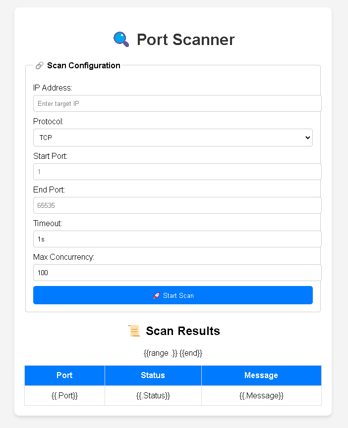

# Go Port Scanner with Web UI

A simple yet powerful port scanner written in Go, featuring a web-based user interface. This tool allows you to scan open ports on a given IP address using TCP or UDP protocols. It supports custom port ranges, concurrency control, and timeout configuration.



---

## Features

- **Web-Based UI**: Easily interact with the port scanner via a browser.
- **Custom Port Range**: Scan a specific range of ports (e.g., 1-1024).
- **Protocol Support**: Scan using TCP or UDP protocols.
- **Concurrency Control**: Limit the number of concurrent scans to avoid overwhelming the system.
- **Timeout Configuration**: Set a custom timeout for each connection attempt.
- **Detailed Results**: View open ports, closed ports, and error messages in a clean table format.

---

## Prerequisites

- **Go**: Ensure Go is installed on your system. You can download it from [golang.org](https://golang.org/dl/).
- **Web Browser**: Any modern web browser to access the UI.

---

## Installation

1. Clone the repository:
   ```bash
   git clone https://github.com/RohanCyberOps/go-port-scanner.git
   cd go-port-scanner
   ```

2. Build and run the application:
   ```bash
   go run main.go
   ```

3. Open your browser and navigate to:
   ```
   http://localhost:8080
   ```

---

## Usage

1. **Enter Scan Details**:
   - **IP Address**: The target IP address to scan.
   - **Protocol**: Choose between `TCP` or `UDP`.
   - **Start Port**: The first port in the range to scan.
   - **End Port**: The last port in the range to scan.
   - **Timeout**: The connection timeout (e.g., `1s` for 1 second).
   - **Max Concurrency**: The maximum number of concurrent scans.

2. **Start the Scan**:
   - Click the **Start Scan** button to begin the scan.

3. **View Results**:
   - The results will be displayed in a table below the form, showing the port number, status (Open/Closed), and a message.

---

## Example

### Input:
- **IP Address**: `127.0.0.1`
- **Protocol**: `TCP`
- **Start Port**: `1`
- **End Port**: `1024`
- **Timeout**: `1s`
- **Max Concurrency**: `100`

### Output:
| Port | Status | Message   |
|------|--------|-----------|
| 22   | Open   | Success   |
| 80   | Open   | Success   |
| 443  | Open   | Success   |
| ...  | Closed | Connection refused |

---

## Project Structure

```
go-port-scanner/
├── main.go            # Main Go application
├── index.html         # HTML template for the UI
├── static/
│   └── style.css      # CSS for styling the UI
├── README.md          # Project documentation
```

---

## Customization

- **Port Range**: Modify the `StartPort` and `EndPort` values in the UI to scan a different range.
- **Concurrency**: Adjust the `Max Concurrency` value to control the number of simultaneous scans.
- **Timeout**: Change the timeout value to increase or decrease the connection attempt duration.

---

## License

This project is licensed under the MIT License. See the [LICENSE](LICENSE) file for details.

---

## Contributing

Contributions are welcome! If you find a bug or have a feature request, please open an issue or submit a pull request.

---

## Author

[Rohan Naagar](https://github.com/RohanCyberOps)

---

Enjoy using the Go Port Scanner! 🚀
